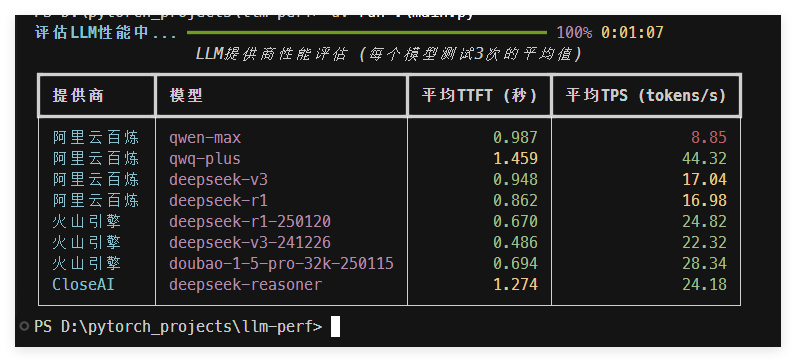

# LLM性能评估工具

这个工具用于评估不同LLM提供商的性能，包括以下指标：
- TTFT (Time To First Token): 从发送请求到收到第一个token的时间
- TPS (Tokens Per Second): 每秒处理的token数量

## 截图


## 配置

在`config.yml`中配置LLM提供商信息, 参考`config.example.yml`

## 安装依赖

使用UV安装依赖

```bash
uv sync
```

## 运行

```bash
uv run main.py
```

