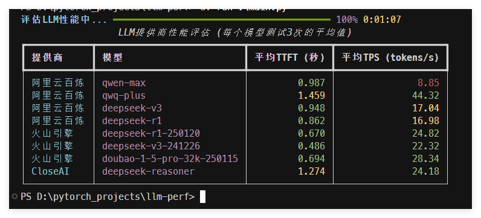

# LLM Performance Evaluation Tool

This tool is used to evaluate the performance of different LLM providers, including the following metrics:

- TTFT (Time To First Token): The time from sending a request to receiving the first token
- TPS (Tokens Per Second): The number of tokens processed per second

## Screenshot



## Configuration

Configure LLM provider information in `config.yml`, refer to `config.example.yml`

## Install Dependencies

Use [UV](https://docs.astral.sh/uv/) to install dependencies

```bash
uv run main.py
``` 